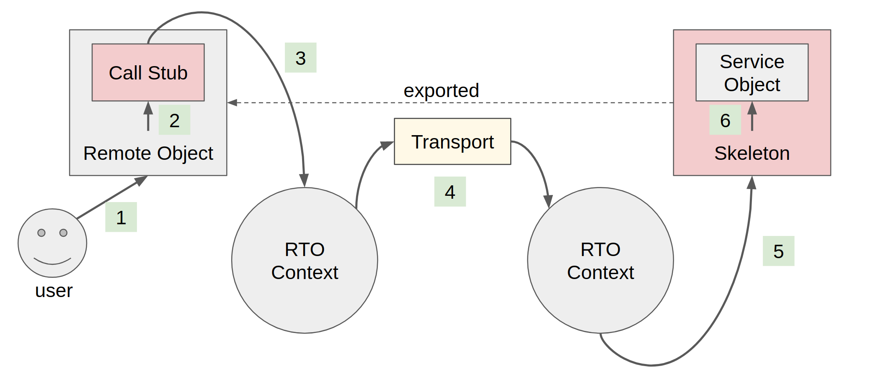

# remote-trait-object

This library provides a simple and powerful remote method invocation support based on Rust's trait objects.
It sets up an connection between two contexts of `remote-trait-object` that may exist over different thread, different processes, or even different machines.
User can freely export a _service object_, and the user of the other side will import such service as a _proxy object_.
Both service object and proxy object are expressed in Rust trait objects, which exposes only **methods** that can be remotely served and called.

The actual communciation upon which such connection is constructed, is abstracted with `TransportRecv` and `TransportSend`.
The implementation of the transport must be supplied by the user, and this library itself provides nothing about the communication.
It can be a plain in-process communication, an Ipc, or even a networking, as you implement.

## Flow

